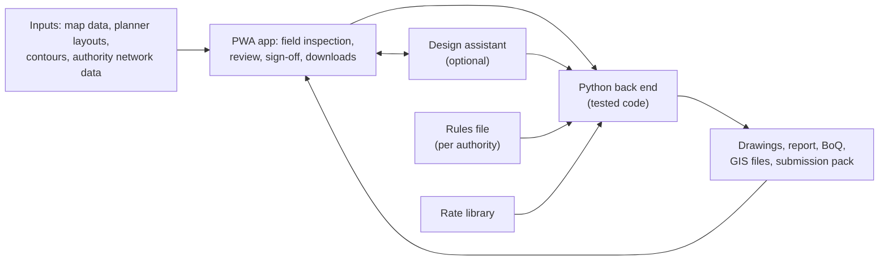

# Electrical Infrastructure Planning and Design App – Requirements Specification

Oct 3, 2026 · Dawie P

Plan and design electrical infrastructure for South African residential areas, from a tablet field inspection to a complete, submission-ready document set.

## Purpose and scope

The app plans and designs electrical networks for residential areas in South Africa, from bulk supply down to the stand connection, and produces a submission-ready document set for Eskom or a municipality.

- **Areas:** new townships, existing suburbs, and informal settlements or upgrades.
- **User:** one registered engineer, who reviews and signs off every design.
- **Devices:** a tablet in the field, then mainly a desktop.
- **Design assistant:** a built-in AI assistant sets up design runs, proposes options, explains results and drafts report text. It uses the same tested tools as the app and never calculates anything itself. The app works fully without it.

## From field to documents

1. **Prepare:** draw the area and import planner layouts and authority data. The app predicts each building's type.
2. **Inspect:** on the tablet, confirm loads, estimate income and ADMD, and mark candidate transformer sites and routes. This works offline.
3. **Design:** the design engine lays out LV, MV and bulk supply, overhead and underground.
4. **Check:** tested code checks voltage, loading, fault levels and mechanical limits.
5. **Compare:** choose between the lowest capital cost, lowest lifetime cost and most spare capacity options.
6. **Review and sign off:** clear the assumptions register, then sign off. The design is saved as a numbered revision.
7. **Document:** generate the drawings, report, bill of quantities, GIS files and submission pack in one step.

Any change to an input, rule or choice updates the affected checks and documents.

## Inputs

The app works with any mix of these, down to map data alone.

| Input | Source | Used for |
| --- | --- | --- |
| Stand layouts | Town planners (CAD, KML) | Stands, roads, servitudes |
| Contours | Topographic survey | Routes, spans, gradients |
| Existing network | Eskom or the municipality | Connection points, capacity, fault levels |
| Map data | OpenStreetMap, with Google satellite as an optional view | Buildings, roads, fallback layout |
| Loads | Field inspection and predictions | Type, ADMD, phase, PV and EV |

Connection points, capacity and fault levels must come from the authority. The app never guesses them.

## Field work

**Predicted building types.** Before the visit, the app predicts each building's type from map tags, municipal zoning, footprint size and, where the licence allows, rooftop images. Each prediction shows its source and confidence, and low-confidence buildings are listed first.

**Inspection.** The inspector confirms or corrects each building as a house, shop, school or other, or marks it not present or new. The inspector also marks possible transformer and mini-sub sites, MV routes and pole sites, and LV routes. Each item gets a GPS position, time, photos and notes, and a progress panel shows what is still to confirm.

**Income and ADMD tool.** The inspector enters what can be seen on site, such as dwelling type, stand size, materials, roof, vehicles, appliances and occupants. The tool estimates an income band and category, then gives the ADMD for the load and the after-diversity demand for a group, such as one transformer. Special loads such as a school or borehole pump are added at their own kVA, and any value can be overridden.

Values and methods come from the rules file, never hard-coded. Estimates stay in the assumptions register until confirmed, and records are kept per load point, not per person. Anything the design places outside the marked sites and routes is flagged as not inspected.

## Design

The design engine works through LV, then MV, then bulk supply, using the confirmed loads and the marked candidates.

| Level | The design must |
| --- | --- |
| LV | Place and phase-balance loads, route lines or cables, size conductors, check voltage drop and fault levels |
| MV | Place transformers and mini-subs, route MV, check loading and voltage |
| Bulk supply | Size the supply, run load flow and IEC 60909 fault studies from the authority's connection point |

**Overhead and underground.** Each segment can be overhead, underground or mixed. Overhead adds checks on spans, sag, clearances, poles and stays; underground adds cable derating for soil, depth and grouping. Where both are allowed, the app shows both options with cost and voltage side by side.

**Optimisation.** The engine makes three designs, each meeting every rule: lowest capital cost, lowest lifetime cost including losses, and most spare capacity within a cost ceiling. Each run places transformers, routes feeders, sizes conductors, balances phases and chooses overhead or underground, then improves the result step by step. The user sets the evaluation period, discount rate, energy cost, growth allowance and any cost ceiling. A compare view shows the options side by side and flags any too close to call on estimated rates.

Every number records its inputs, formula and standard clause.

## Rules and standards

Each authority has a versioned rules file with its own overrides. This starting list must be checked against current editions.

| Standard | Covers |
| --- | --- |
| NRS 034-1 | Residential distribution planning and ADMD |
| NRS 048-2 | Voltage and quality of supply |
| NRS 097-2-1 | Embedded generation |
| SANS 10142-1 | Wiring of premises |
| SANS 10098 | Public lighting |
| SANS 780, SANS 1019 | Transformers and standard ratings |
| SANS 1507, SANS 97 | LV and MV cables |
| IEC 60909 | Fault level calculation |
| Red Book | Human settlement planning and design |

## Outputs and costing

| Output | Contents |
| --- | --- |
| Drawings | DXF, with DWG where an authority needs it |
| Design report | PDF with calculations, assumptions and clause references |
| Bill of quantities | PDF and Excel, with indicative costs |
| GIS files | KML, GeoJSON and Shapefile |
| Submission pack | Authority drawing sheets, title blocks, document register and checklist |

Costs come from a material library of standard items and assemblies, with estimated, dated rates the user can overwrite or refresh from supplier price lists. Costs are always marked as estimates. Every document shows the rules-file version, rate date and design date.

## Review and sign-off

Only the engineer can finalise a design.

- Calculations run only in tested code, never in the language model.
- Methods and results are validated against hand calculations and the authorities' accepted methods.
- The assumptions register lists every estimate and uninspected item, and must be cleared before sign-off.
- The app stops and asks when a required authority input is missing.

## Ease of use and reliability

- Touch-friendly field screens with one-tap confirmation.
- Progress always visible: loads confirmed, items not inspected, assumptions open.
- Nothing is retyped between field, design and documents.
- Field data is saved on the device and synced later; conflicts are shown, never overwritten.
- Calculations are checked against hand-worked test cases before each release.
- Every revision keeps its inputs and versions, so any result can be reproduced.
- Missing or inconsistent inputs are flagged early.
- Data is backed up and exportable in open formats.

## Later features

- **First:** protection and earthing, servitude and clash checks, revision comparison, and PV and EV hosting capacity.
- **Field and workflow:** as-built redlines and a read-only review link.
- **Engineering:** public lighting, staged township development, MV switching and reliability, and existing network upgrades.
- **Upkeep:** a rules change log, and asking the design assistant why it chose a size or route.

## Architecture and platform

A PWA runs the app on the tablet and desktop, and a Python back end does all calculations. The design assistant (Claude) calls the same back-end tools as the app and is optional: if it is unavailable, field work, design and documents still work. pandapower runs load flow and IEC 60909 fault studies, and OpenDSS may be added later for detailed LV unbalance and PV or EV studies. Maps use MapLibre with OpenStreetMap data and offline tiles. Field capture and the income and ADMD tool work offline using cached rules tables; design runs on the server.

Inputs enter through the PWA; the app and the design assistant call the same engineering tools, which draw on the rules file and the rate library, and results return to the PWA for review.

## Build phases and open items

The build runs in eight phases, each usable on its own. The core comes first and works without the design assistant, which is added last.

1. Field capture: map, predicted types, inspection, income and ADMD tool, load schedule
2. LV design for overhead and underground, with checks
3. MV network, transformers and mini-subs
4. Bulk supply: load flow and fault studies
5. Optimisation and option comparison
6. Documents: drawings, report, bill of quantities, GIS files and submission pack
7. Review and sign-off: assumptions register, revisions and audit trail
8. Design assistant: run setup, options, explanations and report drafting

Open items:

- [ ] Confirm the signing engineer's registration is active for submissions
- [ ] Check which authorities require DWG rather than DXF
- [ ] Choose which authority's rules to encode first
- [ ] Decide whether any design calculation must also run offline, beyond capture and the income and ADMD tools
